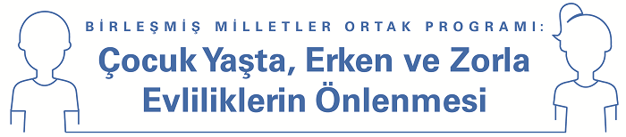
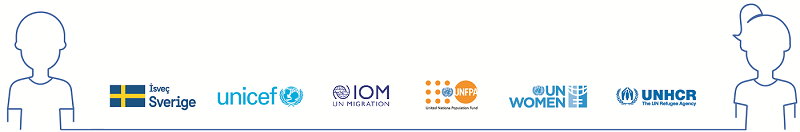

<body>
<h5>

Çocuk Yaşta, Erken ve Zorla Evliliklerin Önlenmesine Yönelik Birleşmiş Milletler Ortak Programının genel amacı kız çocuklarını, oğlan çocuklarını ve risk altında bulunan tüm yetişkinleri çocuk yaşta, erken ve zorla evliliklerden ve bu evliliklerin olumsuz sonuçlarından korumaktır. Bu açıdan ortak program çocuk yaşta, erken ve zorla evliliklerin nedenlerinin ve sonuçlarının belirlenmesini, risk faktörlerinin teşhis edilip sonlandırılmasını ve bu sorunun önüne geçebilmek için kurumsal kapasitenin güçlendirilmesini hedeflemektedir.

Bu program kapsamında, *Çocuk Yaşta, Erken ve Zorla Evlilikler* konusuyla ilgili Türkiye’de üretilmiş ve/veya kullanılmakta olan materyallerin değerlendirildiği *Materyaller Analiz Raporu*nun ve *Materyal Veritabanı*nın, alanda faaliyet gösteren öğrenciler, akademisyenler, gönüllüler, sivil toplum kuruluşları ve diğer tüm ilgililere gerçekleştirilecekleri çalışmalar için yol gösterici olması beklenmektedir.

Veritabanında yer alan tüm materyallere ekranın sol tarafında ve üst tarafında yer alan listeden ulaşabilirsiniz. 
Tüm materyallerin sıralı listesine aşağıda yer alan linklerden ulaşabilirsiniz.

</h5>
</body>

- Materyal Listesi:  [Türkçe](.\downloads\trlist.xlsx ':ignore') [İngilzce](download\englist.xlsx ':ignore')

<!-- background color -->

