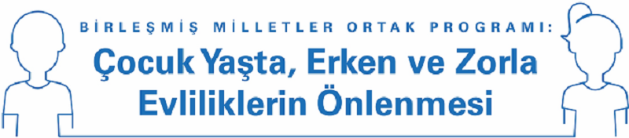

my first c
<body>
<h5>

Çocuk Yaşta, Erken ve Zorla Evliliklerin Önlenmesine Yönelik Birleşmiş Milletler Ortak Programının genel amacı kız çocuklarını, oğlan çocuklarını ve risk altında bulunan tüm yetişkinleri çocuk yaşta, erken ve zorla evliliklerden ve bu evliliklerin olumsuz sonuçlarından korumaktır. Bu açıdan ortak program çocuk yaşta, erken ve zorla evliliklerin nedenlerinin ve sonuçlarının belirlenmesini, risk faktörlerinin teşhis edilip sonlandırılmasını ve bu sorunun önüne geçebilmek için kurumsal kapasitenin güçlendirilmesini hedeflemektedir.

Bu program kapsamında, *Çocuk yaşta, Erken ve Zorla Evlilikler* konularında Türkiye’de üretilmiş ve/veya kullanılmakta olan materyallerin değerlendirildiği *Çocuk Yaşta, Erken ve Zorla Evlilikler Konusunda Türkiye'de Kullanılan Materyaller Raporu*nun ve *Materyal Veritabanı*nın, alanda faaliyet gösteren öğrenciler, akademisyenler, gönüllüler, sivil toplum kuruluşları ve diğer tüm ilgililere gerçekleştirilecekleri çalışmalar için yol gösterici olması beklenmektedir.

Veritabanında yer alan tüm materyallere ekranın sol tarafında yer alan listeden ulaşabilirsiniz. 
Tüm materyallerin sıralı listesine ve rapora aşağıda yer alan linklerden ulaşabilirsiniz.

</h5>
</body>

- [Materyal Analiz Raporu - Word](downloads\trreport.docx ':ignore')
- [Materyal Analiz Raporu - PDF]()
- [Material Overview Report - Word](downloads\engreport.docx ':ignore')
- [Material Overview Report - PDF]()
- [Materyal Listesi - Excel](downloads\trlist.xlsx ':ignore')
- [Material List - Excel]()

<!-- background color -->

