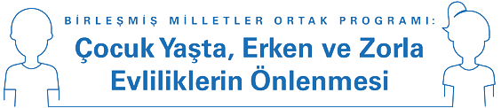

<!-- ## Çocuk Yaşta, Erken ve Zorla Evliliklerin Önlenmesi   Materyal Veritabanı -->
<!--
<small>by UNFPA</small>

> Çocuk Yaşta, Erken ve Zorla Evliliklerin   Önlenmesine Yönelik  Birleşmiş Milletler Ortak Programı 

- Çocuk Yaşta, Erken ve Zorla Evliliklerin Önlenmesine Yönelik Birleşmiş Milletler Ortak Programının genel amacı kız çocuklarını, oğlan çocuklarını ve risk altında bulunan tüm yetişkinleri çocuk yaşta, erken ve zorla evliliklerden ve bu evliliklerin olumsuz sonuçlarından korumaktır. Bu açıdan ortak program çocuk yaşta, erken ve zorla evliliklerin nedenlerinin ve sonuçlarının belirlenmesini, risk faktörlerinin teşhis edilip sonlandırılmasını ve bu sorunun önüne geçebilmek için kurumsal kapasitenin güçlendirilmesini hedeflemektedir.

-->

## Materyal Veritabanı *

* Bu veritabanı UNFPA, Birleşmiş Milletler Nüfus Fonu Türkiye'nin katkıları ile hazırlanmıştır.   Veritabanınında yer alan materyallerden yalnızca materyallerin hak sahipleri, ilgili kurum ve kuruluşlar sorumludur.   Bu içerikler herhangi bir şekilde UNFPA, Birleşmiş Milletler Nüfus Fonu Türkiye’nin görüş veya tutumunu yansıtmaz.

<!-- [Materyal Veritabanına İlerle](#Başlarken)  turn on after content is stable --> 

[UNFPA Türkiye Web Sayfası](https://turkey.unfpa.org/en ':target=_blank')  
[Güncelleniyor Daha Sonra Tekrar Ziyaret Ediniz]()

<!-- background image -->

